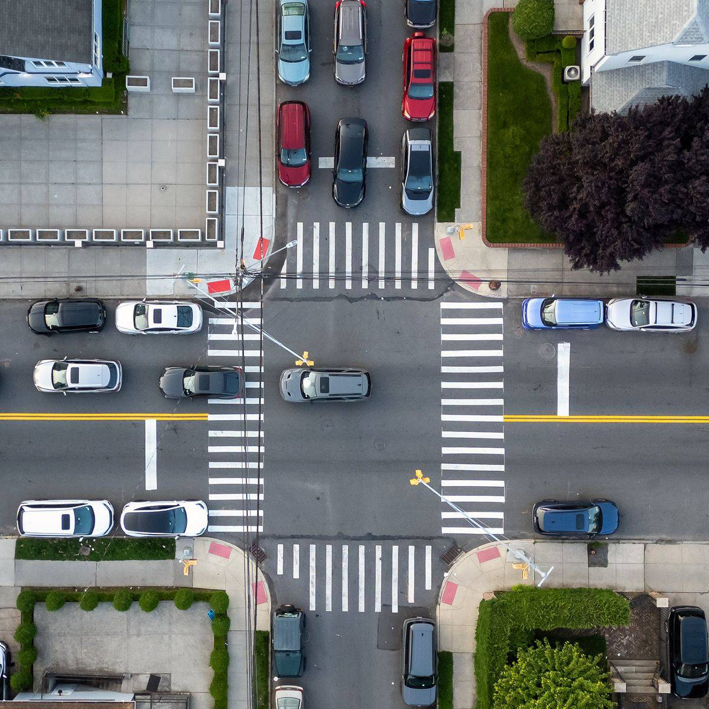
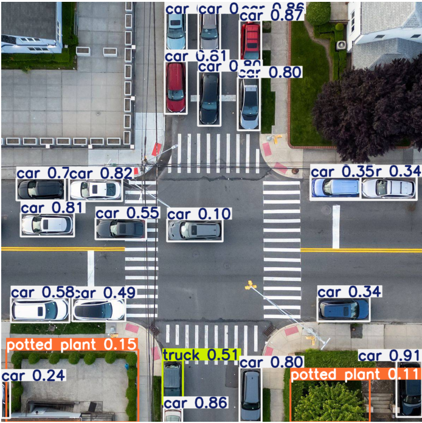

# Traffic-Analysis-YOLO
# Traffic Vehicle Counting using YOLO-World

## Overview

This project uses YOLO-World to detect vehicles in a traffic intersection image and count them within predefined Regions of Interest (ROIs).

The main goal is to analyze vehicle distribution around pedestrian crosswalks.

---

## Tasks

### 1. Total Vehicle Count

Count the total number of detected vehicles in the image.

### 2. Top Crosswalk ROI

Count vehicles located behind the top pedestrian crosswalk.

### 3. ROI-Based Vehicle Counting

Count vehicles inside each predefined ROI:

* Top ROI
* Bottom ROI
* Left ROI
* Right ROI

---

## Approach

### Vehicle Detection

The project uses the YOLO-World model (`yolov8x-world.pt`) to detect objects in the traffic image.

Only the following classes are considered for traffic analysis:

* Car
* Truck

All other detected classes are ignored.

### Vehicle Center Extraction

For each detected vehicle, the center point of its bounding box is calculated:

```python
cx = (x1 + x2) / 2
cy = (y1 + y2) / 2
```

### ROI Definition

Four polygon-based ROIs are manually defined using Shapely:

* Top ROI
* Bottom ROI
* Left ROI
* Right ROI

### Vehicle Counting

A vehicle is counted inside an ROI if the center point of its bounding box lies within the ROI polygon.

---

## Technologies

* Python
* YOLO-World
* OpenCV
* Shapely
* NumPy
* Matplotlib
* Jupyter Notebook

---

## Input Image



---

## Detection Result

YOLO-World object detection output.



---

## Example Output

```text
total_cars : XX

top_roi : XX

top_roi : XX
bottom_roi : XX
left_roi : XX
right_roi : XX
```

---

## Project Structure

```text
Traffic-Analysis-YOLO/
│
├── yolo_f.ipynb
├── IMG_20260608_233848_316.jpg
├── README.md
│
└── results/
    ├── input_image.jpg
    ├── detection_result.jpg
    └── roi_visualization.jpg
```


